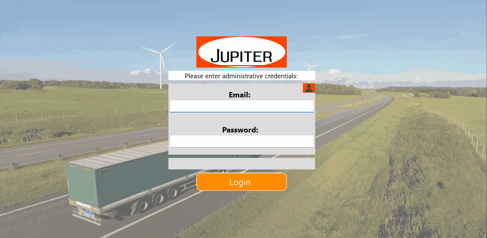
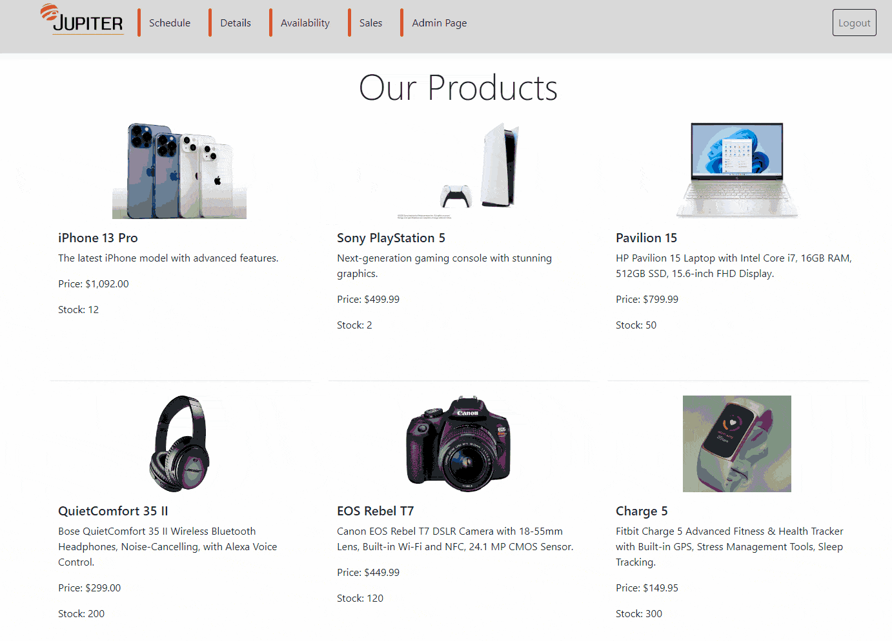

# Media Bazaar Logistics Management System

## About

I led a team to develop a **Media Bazaar Logistics System** using **C# .NET**. The system includes role-based user management, stock tracking, and task allocation modules to optimize logistics operations. Key features include:
- **Role-based User Management**: Different user roles for managing system access and functionality (Security Guard, Depot Worker, Sales Rep, Department Manager).
- **Stock Tracking**: Efficient inventory management with real-time stock updates.
- **Task Allocation**: A system for assigning and managing tasks among employees.
- **Admin Statistics**: Admin-specific reports for analyzing performance and system usage, helping to improve operational efficiency and team collaboration.

This project is designed to streamline logistics operations, improve communication among departments, and enhance overall productivity.

## Setup & Usage

For users and testers outside of Fontys, please ensure you have an active VPN connection to `vdi.fhict.nl` to access the MS SQL database.

### Credentials

- **Security Guard**:  
  - Username: `matei.johnson@example.co`  
  - Password: `V{#zV1ZnsMG!`

- **Depot Worker**:  
  - Username: `alice.johanson@example.com`  
  - Password: `12345`

- **Sales Rep**:  
  - Username: `emily.davis@example.com`  
  - Password: `@8W4:D\qtC7"`

- **Department Manager**:  
  - Username: `mamamia12@gmail.com`  
  - Password: `n-I]643?.b,X`

**Note**: These credentials correspond to the different roles available in the system, each providing specific functionalities for users.

### Google API Details

The system uses Google APIs for certain functionality. Below are the API credentials:

- **CSE ID**: `e0572abc8afc7407e`

## Repository

You can find the source code and further documentation in the GitHub repository:  
[Media Bazaar Logistics Management System Repository](https://git.fhict.nl/I524441/the-clubhouse-s2-group-project)

## Features

- **Role-Based Access Control**: The system features specific access for different roles including Security Guards, Depot Workers, Sales Representatives, and Department Managers.
- **Stock Management**: Track stock levels, update inventory, and generate stock reports.
- **Task Management**: Assign, monitor, and track tasks for employees, ensuring better workflow and productivity.
- **Admin Stats**: Admin users can access detailed reports and performance metrics for team and system analysis.

## Demo

### 1. **Desktop App Demo**  

### 2. **Web App Demo**  

## Contributing

Feel free to fork this repository and submit pull requests for improvements or bug fixes. Contributions are welcome!

## License

This project is licensed under the MIT License - see the [LICENSE](LICENSE) file for details.
